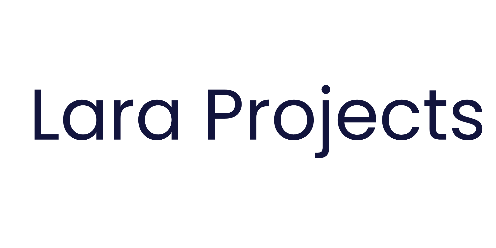
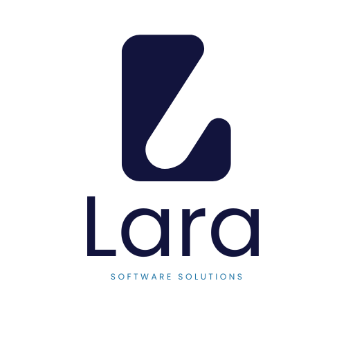

Colección de cuatro proyectos desarrollados durante el semestre y un lanzador
principal con interfaz gráfica. El menú principal permite abrir cada proyecto
de forma independiente y proporciona un acceso directo a un visualizador web
del algoritmo de Dijkstra incluido en el repositorio.

## Estructura del repositorio

```
LARA-PROJECTS/
├── main.py              # Menú principal en PyQt5
├── proyecto1/           # Generador de tablas de verdad (PySide6)
├── proyecto2/           # Simplificador booleano con SymPy (PyQt6)
├── proyecto3/           # Analizador y probador de expresiones regulares (REEGEX) (PyQt6)
├── proyecto4/           # Visualizador web interactivo del algoritmo de Dijkstra
├── header.png, logo.png # Recursos de interfaz del menú principal
└── README.md
```

## Configuración rápida

1. **Instala todas las dependencias de Python con un solo comando:**

   ```bash
   pip install -r requirements.txt
   ```

2. **Ejecuta el menú principal:**

   ```bash
   python3 main.py
   ```

## Dependencias

Las dependencias compartidas se definen en `requirements.txt`:

- `PyQt5`: interfaz del menú principal.
- `PySide6`: GUI del generador de tablas de verdad.
- `PyQt6`: interfaces para el simplificador booleano y el probador de regex.
- `sympy`: simplificación booleana simbólica en `proyecto2`.

## Descripción de los proyectos

### Menú principal (`main.py`)

Aplicación PyQt5 que centraliza los accesos a cada proyecto.

### Proyecto 1 — Generador de tablas de verdad (`proyecto1/`)

- Construido con PySide6.
- Genera tablas de verdad a partir de expresiones booleanas.
- Permite exportar resultados en formatos CSV y JSON.

### Proyecto 2 — Simplificación booleana (`proyecto2/`)

- Basado en PyQt6 y `sympy`.
- Simplifica expresiones booleanas mostrando los pasos principales del proceso.

### Proyecto 3 — Analizador de expresiones regulares (`proyecto3/`)

- Implementado con PyQt6.
- Destaca coincidencias en texto, evalúa patrones y valida expresiones en
  tiempo real.

### Proyecto 4 — Visualizador web de Dijkstra (`proyecto4/`)

- Interfaz web estática (HTML, CSS y TypeScript) para construir grafos dirigidos
  con pesos no negativos.
- Permite añadir nodos y aristas, importar/exportar el grafo como JSON y
  ejecutar el algoritmo de Dijkstra para mostrar distancias mínimas, predecesor
  y ruta.
- Puede abrirse directamente desde un navegador o a través del menú principal.

# By Derek Calderón, Adrián Matul & Diego Ovalle


